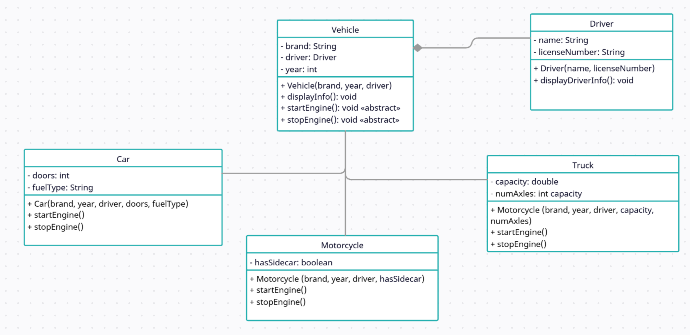
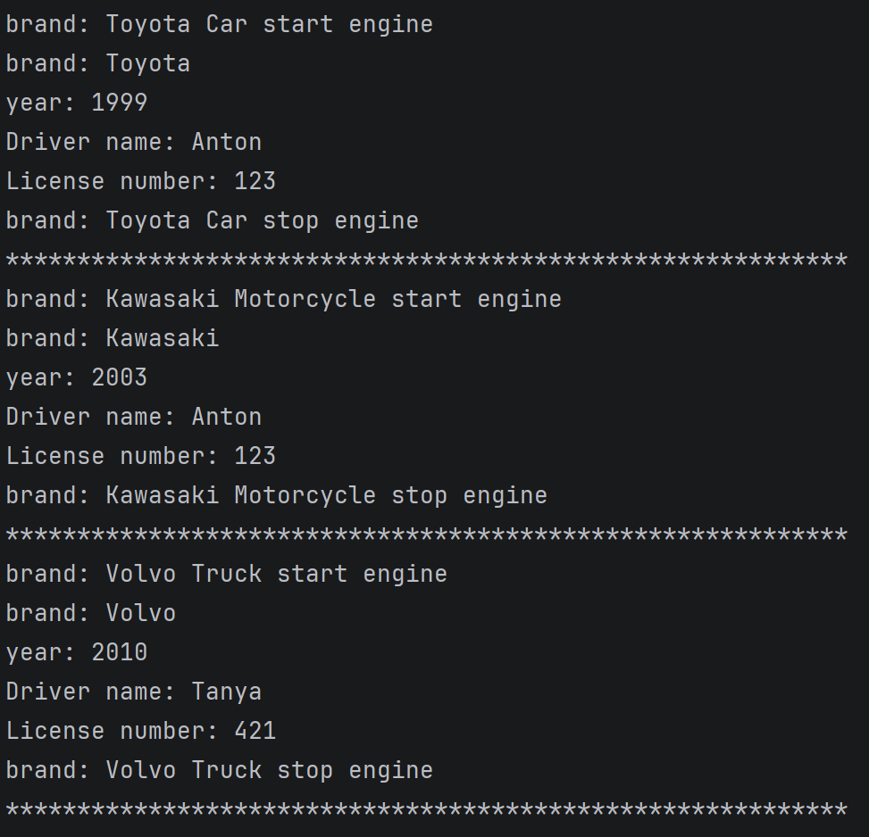

* A
   * The Vehicle Management System helps to manage different vehicles and their drivers. It shows how to organize cars, motorcycles, and trucks, and link them with drivers using object-oriented programming
   * Inheritance: Vehicle class is the base for Car, Motorcycle, and Truck. It saves code and makes design simple.
   * Abstraction: startEngine() and stopEngine() are abstract. Each vehicle has its own version.
   * Composition: Each vehicle has a Driver. One driver can have many vehicles.
* B
      
* C
  1. Open a terminal/command prompt.
  2. Navigate to the directory containing the Java files (Vehicle.java, Car.java, Motorcycle.java, Truck.java, Driver.java, Main.java).
  3. Compile all Java files:  
    javac *.java
  4. Run the main program:
    java Main
* D
      
* E
   * Inheritance made the design simpler because we did not need to write the same code for every vehicle type. Method overriding helped to customize behavior each vehicle can start and stop its engine in its own way.
   * Using protected and default access modifiers was sometimes tricky. Protected allows subclasses to use fields, but other classes cannot. Default access allows classes in the same package to see fields, but it is limited for other packages.
